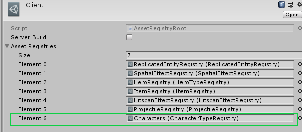
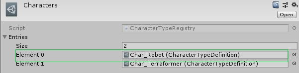
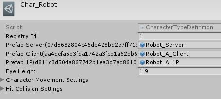
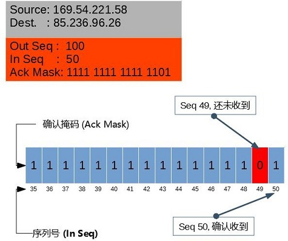
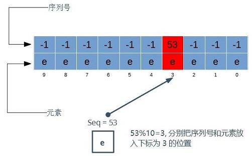
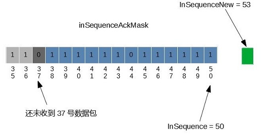
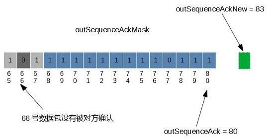
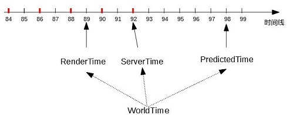
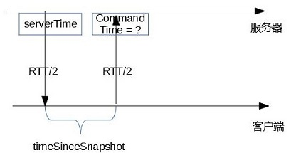

在FPSSample项目之前Unity官方出的示例都只是展示某一项技术，没有真正完整的大型项目。要做出真正易用的引擎，引擎开发商要使用自己的引擎做实际的项目，然后根据开发体验改进引擎，这样才会不断提高引擎的易用性，厨师要吃自己做的菜才能成为好厨师。很高兴看到Unity官方能做出FPSSample这样的项目，这代表了Unity态度的转变，事情在往好的方向发展。

FPSSample的Github地址是[https://github.com/Unity-Technologies/FPSSample](https://github.com/Unity-Technologies/FPSSample)，这是一个包括了服务器和客户端的多人射击游戏，这篇文章主要分析资源管理，网络传输和同步。

## 总体分析

在阅读代码前需要先了解一下ECS，可以参考这个[教程](https://unity3d.com/learn/tutorials/topics/scripting/introduction-ecs)。项目里所用到的ECS知识点较为简单，这里简单介绍一下。ECS是一种以数据为中心的编程范式，它分离了数据和行为，包含三个要素：实体(Entity)，组件(Component)和系统(System)，其中Entity是用来引用Component的，Component只包含了纯数据，System首先过滤要操作的Component然后定义行为。下面举例说明项目中怎么使用ECS的。

```CSharp
// Component需要是struct，并且实现IComponentData接口
public struct Foo : IComponentData
{
    public int value;
}

public struct Bar : IComponentData
{
    public int value;
}

// Entity的创建和组件添加
// Entity e = entityManager.CreateEntity();
// entityManager.AddComponentData(e, new Foo{value = 0});
// entityManager.AddComponentData(e, new Bar{value = 1});
// entityManager.SetComponentData(e, new Bar{value = 100});

// Unity提供了ComponentSystem和用于多线程的JobComponentSystem，
// 目前项目没有用到JobComponentSystem
public class FoobarSystem : ComponentSystem
{
    ComponentGroup group;

    // 通过注入的方式指定过滤的Component
    // public struct GroupType
    // {
    //    public readonly int Length;
    //    public ComponentDataArray<Foo> Foo;
    //    public ComponentDataArray<Bar> Bar;
    // }
    // [Inject] GroupType group;

    protected override void OnCreateManager(int capacity)
    {
        base.OnCreateManager(capacity);
        // 通过API指定这个System要操作带所有同时具有Foo和Bar组件实体
        // 还有一种就是上面演示的那样通过[Inject]注入的方式指定
        group = GetComponentGroup(typeof(Foo), typeof(Bar));
    }

    protected override void OnUpdate()
    {
        // 获取所有满足条件的Entity
        EntityArray entityArray = group.GetEntityArray();
        // 获取组件
        ComponentDataArray fooArray = group.GetComponentDataArray<Foo>();
        ComponentDataArray barArray = group.GetComponentDataArray<Foo>();
       
       for(int i = 0; i < fooArray.Length; i++)
       {
           Foo foo =  fooArray[i];
           Bar bar = barArray[i];
           foo.value = bar.value;

            // 正常情况下操作组件是通过EntityManager的API实现的，
            // 而这里因为操作组件会破坏内部的数据结构，导致fooArray元素变化，所以使用PostUpdateCommands使操作延迟作用
           // 需要重新设置Entity的Foo组件数据，因为Foo是个struct
           PostUpdateCommands.SetComponentData(entityArray[i], foo);
           PostUpdateCommands.RemoveComponent<Bar>(entityArray[i]);
       }
    }
}
```
上面演示的是纯ECS(Pure ECS)的用法，Unity还提供了一套混合ECS(Hybrid ECS)用于Monobehavivor和ECS的结合，两者写法差不多，不再说明。

[Game](https://github.com/Unity-Technologies/FPSSample/blob/fa73e3942eaf49a24d2c40f85cd0caa404c91cff/Assets/Scripts/Game/Main/Game.cs#L92)类定义了程序的入口，[Game.Update](https://github.com/Unity-Technologies/FPSSample/blob/fa73e3942eaf49a24d2c40f85cd0caa404c91cff/Assets/Scripts/Game/Main/Game.cs#L499)驱动游戏的主要逻辑[IGameLoop](https://github.com/Unity-Technologies/FPSSample/blob/fa73e3942eaf49a24d2c40f85cd0caa404c91cff/Assets/Scripts/Game/Main/Game.cs#L155)。项目中定义了三种IGameLoop: [ClientGameLoop](https://github.com/Unity-Technologies/FPSSample/blob/fa73e3942eaf49a24d2c40f85cd0caa404c91cff/Assets/Scripts/Game/Main/ClientGameLoop.cs#L28), [ServerGameLoop](https://github.com/Unity-Technologies/FPSSample/blob/fa73e3942eaf49a24d2c40f85cd0caa404c91cff/Assets/Scripts/Game/Main/ServerGameLoop.cs#L10), [PreviewGameLoop](https://github.com/Unity-Technologies/FPSSample/blob/fa73e3942eaf49a24d2c40f85cd0caa404c91cff/Assets/Scripts/Game/Main/PreviewGameLoop.cs#L7)，分别对应者客户端，服务器以及混合的服务器和客户端，这些IGameLoop驱动着ECS的ComponentSystem的运行。

游戏的一部分代码是按module来组织的，module定义了相关的Component，ComponentSystem和一些其它的类。module有客户端和服务器的相关代码，也有共享的代码。

## 资源管理

Assetbundle的管理是令人非常头疼的，按照官方推荐的[最佳实践](https://unity3d.com/learn/tutorials/topics/best-practices/assetbundle-usage-patterns)，AssetBundle细粒度划分会让代码变得复杂，粗粒度划分会浪费内存。项目中使用ScriptableObject来管理资源，关于ScriptableObject的高级用法请[参考这里](https://blogs.unity3d.com/2017/11/20/making-cool-stuff-with-scriptableobjects/)。如图1所示，项目中有7个继承自RegistryBase(RegistryBase继承自ScritableObject)的类管理对应的7大类预制体，包括同步实体([ReplicatedEntityRegistry](https://github.com/Unity-Technologies/FPSSample/blob/fa73e3942eaf49a24d2c40f85cd0caa404c91cff/Assets/Scripts/Game/Modules/ReplicatedEntity/ReplicatedEntityRegistry.cs#L25))，空间特效([SpatialEffectRegistry](https://github.com/Unity-Technologies/FPSSample/blob/fa73e3942eaf49a24d2c40f85cd0caa404c91cff/Assets/Scripts/Game/Modules/Effect/SpatialEffect/SpatialEffectRegistry.cs#L8))，英雄([HeroTypeRegistry](https://github.com/Unity-Technologies/FPSSample/blob/fa73e3942eaf49a24d2c40f85cd0caa404c91cff/Assets/Scripts/Game/Modules/Character/HeroTypeRegistry.cs#L5))，物品([ItemRegistry](https://github.com/Unity-Technologies/FPSSample/blob/fa73e3942eaf49a24d2c40f85cd0caa404c91cff/Assets/Scripts/Game/Modules/Item/ItemRegistry.cs#L4))，hitscan特效([HitscanEffectRegistry](https://github.com/Unity-Technologies/FPSSample/blob/fa73e3942eaf49a24d2c40f85cd0caa404c91cff/Assets/Scripts/Game/Modules/Effect/HitscanEffect/HitscanEffectRegistry.cs#L4))，子弹([ProjectileRegistry](https://github.com/Unity-Technologies/FPSSample/blob/fa73e3942eaf49a24d2c40f85cd0caa404c91cff/Assets/Scripts/Game/Modules/Projectile/ProjectileRegistry.cs#L8)),角色([CharacterTypeRegistry](https://github.com/Unity-Technologies/FPSSample/blob/fa73e3942eaf49a24d2c40f85cd0caa404c91cff/Assets/Scripts/Game/Modules/Character/CharacterTypeRegistry.cs#L8))，这些Registry类间接或直接引用预制体。ScriptableObject是通过guid来引用资源，也就是弱引用([WeakAssetReference](https://github.com/Unity-Technologies/FPSSample/blob/fa73e3942eaf49a24d2c40f85cd0caa404c91cff/Assets/Scripts/Utils/WeakAssetReference/WeakAssetReference.cs#L26))，这种引用方式不会导致所引用的资源随着ScriptableObject打包而被打包。这样打包工具就可以遍历执行这些Regsitry重写的RegistryBase.GetSingleAssetGUIDs来获取引用的预制体GUID，然后每一个预制体打包成以GUID为名称的Assetbundle，请参考代码([BundledResourceBuilder.BuildBundles](https://github.com/Unity-Technologies/FPSSample/blob/fa73e3942eaf49a24d2c40f85cd0caa404c91cff/Assets/Scripts/Utils/BundledResource/Editor/BundledResourceBuilder.cs#L117))。同时代码中从Restiry可以很方便的获取到预制体GUID，然后根据GUID加载AssetBundle。这样打包和加载都是使用Registry的数据，开发者只需要管理好Registry就行了。

下图显示ScriptableObject如何管理资源的





相关代码
```
public abstract class RegistryBase : ScriptableObject      
{
#if UNITY_EDITOR
    // 用来填充Registry数据
    public virtual void UpdateRegistry(bool dry) { }
    // 获取Registry引用的所有预制体guid
    public abstract void GetSingleAssetGUIDs(List<string> guids, bool serverBuild);
    // 验证资源
    public virtual bool Verify()
    {
        return true;
    }
#endif
}
// 以GUID引用资源，
public class WeakAssetReference
{
    public string guid = "";
}
```

## 网络传输
从四个方面去分析：采用何种传输协议，数据包(package)头部格式，消息(message)格式以及实现
### 采用何种传输协议
项目采用UDP Socket进行通讯，关于TCP和UDP的比较可以参考[这篇文章](https://gafferongames.com/post/udp_vs_tcp/)。TCP是一种基于流式的传输协议，为了保证可靠性需要做很多工作，网络环境比较差时传输效率很低。UDP是一种高效的传输协议，但是需要应用层识别丢包乱序问题并作出相应的处理。

UDP数据包在网络传输中会重复，乱序和丢失，通过给每个发送的数据包加序列号Seq，接收方就可以识别出重复和乱序问题并作出相应处理。丢包则需要接收方通知发送方数据包的接收情况，这样发送方可以根据情况重发。接收方在下次返回的数据包中增加自己所收到的最大数据包序列号和表示最近16个数据包接收状况的掩码，这样发送方就可以知道自己发出的过去16个数据包的接收情况。

图1

Out Seq表示当前数据包序列号，In Seq表示本地收到数据包的最大序列号，Ack Mask表示之前收到的16个数据包的接收情况

### 数据包(package)头部格式
直接分析[NetworkConnection.BeginSendPackage](https://github.com/Unity-Technologies/FPSSample/blob/fa73e3942eaf49a24d2c40f85cd0caa404c91cff/Assets/Scripts/Networking/NetworkConnection.cs#L354)代码可以看出数据包头部格式
```Csharp
        output.WriteBits(0, 8);                                 // 0-7位为数据包类型,由NetworkMessage定义
        output.WriteBits(Sequence.ToUInt16(outSequence), 16);   // 8-23位为输出数据包序列号
        output.WriteBits(Sequence.ToUInt16(inSequence), 16);    // 24-39位为收到的最大输入数据包序列号
        output.WriteBits(inSequenceAckMask, 16);               // 40-55位为输入数据包掩码

        if (outSequence % 3 == 0) // 每3个数据包写入从收到输入数据包到发出确认的时间间隔，用于计算rtt
        {
            var now = NetworkUtils.stopwatch.ElapsedMilliseconds;
            var timeOnServer = (byte)Math.Min(now - inSequenceTime, 255);
            output.WriteBits(timeOnServer, 8);
        }

        output.Align(); // 如果当前头部数据位数不满足8的倍数，则填充0直至字节对齐，

        // 接下来写入数据包主体,也就是消息(message)数据
  ```
### 消息(message)格式
当数据包(package)承载不同类型的消息时会把相应类型信息(NetworkMessage)写入头8个字节。项目中存在两种定义消息格式的方式，一种是手动数据拼接，这种适用于比较简单的消息，一种是自动生成消息格式(NetworkSchema)，在第一次发送这类消息时把消息格式(NetworkSchema)发送给对方，对方按照此消息格式解析，并把保存消息格式，这样下次发送方就不再发送。

消息类型定义
```Csharp
public enum NetworkMessage
{
    // Shared messages
    Events      = 1 << 0, // 除了下面定义的消息类型以外的类型，一般是自定义的消息

    // Server -> Client messages
    ClientInfo  = 1 << 1, // 服务器把一些配置信息发给客户端，如协议版本号protocolId，数据压缩模型NetworkCompressionModel
    MapInfo     = 1 << 2, // 地图信息
    Snapshot    = 1 << 3, // 服务器快照数据

    // Client -> Server messages
    ClientConfig  = 1 << 1, // 需要通知给服务器的客户端参数
    Commands    = 1 << 2, // 客户端的输入指令

    FRAGMENT = 1 << 7,   // 标识数据包是否被分包
}
```

NetworkSchema定义了每个字段的类型，位数，数据压缩,精度等信息
```CSharp
public class NetworkSchema
{
    ...

    public class FieldInfo // 字段定义
    {
        public string name;             // 字段名称，用于调试
        public FieldType fieldType;     // 字段类型
        public int bits;                // 字段位数
        public bool delta;              // 是否压缩过
        public int precision;           // 精度，表示{ 1.0f, 10.0f, 100.0f, 1000.0f }数组的下标，用于把浮点数转成整数 
        public int arraySize;           // 数组或字符串长度
        public int byteOffset;          // 字段的偏移量
        public int startContext;        // 用于数据压缩
        public byte fieldMask;          // 忽略被屏蔽的字段

        public FieldStatsBase stats;    // 用于编辑器中显示消息的统计信息
    }

    public List<FieldInfo> fields = new List<FieldInfo>();  // 消息的字段列表
    public int nextFieldOffset = 0;                         // 记录下一个字段的偏移量，用于计算FieldInfo.byteOffset
    public int id;                                          // 消息id

    ...
}
```

### 实现分析

* 数据包发送

    产生的消息不会被马上发送，而是放入队列中定时发送。每次发送时会把所有的消息序列化成一个或者多个数据包(fragment)发送出去，并用一个PackageInfo对象这些记录这些消息，然后把这个对象按序列号保存到一个队列([SequenceBuffer](https://github.com/Unity-Technologies/FPSSample/blob/fa73e3942eaf49a24d2c40f85cd0caa404c91cff/Assets/Scripts/Networking/SequenceBuffer.cs#L64))中，以后收到对方的数据包时会用到这个信息([NetConnection.NotifyDelivered](https://github.com/Unity-Technologies/FPSSample/blob/fa73e3942eaf49a24d2c40f85cd0caa404c91cff/Assets/Scripts/Networking/NetworkConnection.cs#L444))。

    ```CSharp
    // 表示本地发出的数据包信息，用于把数据包和所承载的消息建立起联系
    public class PackageInfo
    {
        // 发送时间，用于计算RTT
        public long sentTime;
        // 是否分包，当数据包过大时会分成几个数据包
        public bool fragmented;
        // 数据包携带的消息类型
        public NetworkMessage content;
        // 数据包携带的NetworkMessage.Events类型的消息
        public List<NetworkEvent> events = new List<NetworkEvent>(10);
    }

    // 客户端数据包，把数据包和指令建立起联系
    class ClientPackageInfo : PackageInfo
    { 
        // 指令时间，客户端预测指令在服务器上将于何时执行，网络同步部分有详细说明
        public int commandTime; 
        // 数据包携带的最大指令序号
        // 这个用于把数据包和指令建立起联系，当这个数据包被确认就意味着commandSequence序号的指令被确认
        public int commandSequence;
    }

    // 服务器数据包，把数据包和快照建立起联系
    public class ServerPackageInfo : PackageInfo
    {
        // 快照序列号，用于把数据包和快照建立起联系，当这个数据包被确认也就是意味着serverSequence序号的快照被确认
        public int serverSequence; 
        // 快照发生的时间
        public int serverTime;
    }
    ```

* SequenceBuffer

    [SequnceBuffer](https://github.com/Unity-Technologies/FPSSample/blob/fa73e3942eaf49a24d2c40f85cd0caa404c91cff/Assets/Scripts/Networking/SequenceBuffer.cs#L64)具有对象池的功能，可以由序列号获取对象。内部实现是两个数组，一个记录序列号，一个记录对应的元素。下图说明了SequenceBuffer的工作原理。

    图2

* 消息可靠性

    [NetworkConnection](https://github.com/Unity-Technologies/FPSSample/blob/fa73e3942eaf49a24d2c40f85cd0caa404c91cff/Assets/Scripts/Networking/NetworkConnection.cs#L62)保存了当前链接收到数据包的最大序列号(inSequence)以及对应的确认掩码(inSequenceAckMask)，发出的最大数据包序列(outSequence)以及对应的确认掩码(outSequenceAck)。当收到新的数据包时，读取数据包头部中的序列号(inSequenceNew)，对方确认过的最大序列号(outSequenceAckNew)以及掩码(outSequenceAckMaskNew)。如果inSequenceNew大于inSequence，则把inSequenceAckMask左移(inSequenceNew-inSequence)位，也就是说这些掩码位对应的数据包丢失了。如果outSequenceAckNew大于outSequenceAck，则检查outSequenceAckMask的最后(outSequenceAckNew-outSequenceAck)位，如果某一个位是0，则认为这个掩码对应的数据包已经丢失，就重新发送那些要求可靠性的消息。这里只描述了关键情况，其它情况请看下面的代码注释。

    图3

    上图表示收到一个新的序列号为53的数据包，需要把inSequenceAckMask左移(53-50=3)位，这时掩码的35,36,37位被丢弃，而37号数据还未收到，就认为这个数据包已经丢失。

    图4

    上图表示对方确认过的最大序列号是83，找出outSequenceAckMask的最后(83-80=3)位中未被确认过的66号数据包，重新发送其对应的可靠消息。更新outSequenceAckMask的值为outSequenceAckMaskNew，outSequence的值为outSequenceAckNew。

    下面的[NetworkConnection.ProcessPackageHeader](https://github.com/Unity-Technologies/FPSSample/blob/fa73e3942eaf49a24d2c40f85cd0caa404c91cff/Assets/Scripts/Networking/NetworkConnection.cs#L152)方法实现了上面描述的功能

    ```CSharp
    // 记录发出去的数据包
    public SequenceBuffer<TPackageInfo> outstandingPackages = new SequenceBuffer<TPackageInfo>(64, () => new TPackageInfo());

    // 处理收到的数据包头部信息
    protected int ProcessPackageHeader(byte[] packageData, int packageSize,
    out NetworkMessage content, out byte[] assembledData, out int assembledSize, out int headerSize)
    {
        var input = new BitInputStream(packageData);
        ...

        // 输入数据包序列号
        var inSequenceNew = Sequence.FromUInt16((ushort)input.ReadBits(16), inSequence);
        // 接受方确认过的输出数据包最大序列号
        var outSequenceAckNew = Sequence.FromUInt16((ushort)input.ReadBits(16), outSequenceAck);
        // 以16个二进制位掩码表示的接受方确认过的数据包
        var outSequenceAckMaskNew = (ushort)input.ReadBits(16);

            if (inSequenceNew > inSequence)
        {
                // 计算新的数据包序列号和最大数据包序列号间隔
            var distance = inSequenceNew - inSequence;

            for (var i = 0; i < Math.Min(distance, 15); ++i)    // TODO : Fix this contant
            {
                    // 统计丢失的数据包
                if ((inSequenceAckMask & 1 << (15 - i)) == 0)
                    counters.packagesLostIn++;
            }

            // 如果间隔大于15位掩码能表示的，则之前的掩码位全部丢掉，并写入新的掩码位
            if (distance > 15)
            {
                counters.packagesLostIn += distance - 15;
                inSequenceAckMask = 1; // all is lost except current package
            }
            // 否则丢掉前distance个掩码位
            else
            {
                inSequenceAckMask <<= distance;
                inSequenceAckMask |= 1;
            }

            // 记录新的最大输入数据包序列号
            inSequence = inSequenceNew;
            // 新的接受时间
            inSequenceTime = NetworkUtils.stopwatch.ElapsedMilliseconds;
        }
        // 数据包乱序
        else if (inSequenceNew < inSequence)
        {
            var distance = inSequence - inSequenceNew;
            // 如果数据包太旧，不做处理
            if (distance > 15) // TODO : Fix this constant
            {
                counters.packagesStaleIn++;
                return 0;
            }

            // 检查是否收到过这个数据包，如果收到过则重复，不做处理
            var ackBit = 1 << distance;
            if ((ackBit & inSequenceAckMask) != 0)
            {
                counters.packagesDuplicateIn++;
                return 0;
            }

            // 写入掩码位
            counters.packagesOutOfOrderIn++;
            inSequenceAckMask |= (ushort)ackBit;
        }
        // 数据包重复，不做处理
        else
        {
            counters.packagesDuplicateIn++;
            return 0;
        }

        // 如果收到的确认过的最大输出数据包序列号小于现在的，则直接不做处理
        if (outSequenceAckNew <= outSequenceAck)
        {
            headerSize = input.Align();
            return inSequenceNew;
        }

        // 找出丢失的输出数据包序列号，并重新发送
        var seqsBeforeThisAlreadyNotifedAsLost = outSequenceAck - 15;
        var seqsBeforeThisAreLost = outSequenceAckNew - 15;

        // 检查旧的输出包掩码的前(seqsBeforeThisAreLost - seqsBeforeThisAlreadyNotifedAsLost + 1)位，
        for (int sequence = seqsBeforeThisAlreadyNotifedAsLost; sequence <= seqsBeforeThisAreLost; ++sequence)
        {
            // 序列号小于0表示总共发出的数据包不到16个，
            if (sequence < 0)
                continue;

            int bitnum = outSequenceAck - sequence;
            var ackBit = bitnum >= 0 ? 1 << bitnum : 0;
            var notNotified = (ackBit & outSequenceAckMask) == 0;

            // 如果发现有未确认的数据包，则把数据包中要求可靠性的消息放到下一次的队列中
            if (outstandingPackages.Exists(sequence) && notNotified)
            {
                var info = outstandingPackages[sequence];
                NotifyDelivered(sequence, info, false);

                counters.packagesLostOut++;
                if (info.fragmented)
                    counters.fragmentedPackagesLostOut++;

                info.Reset();
                outstandingPackages.Remove(sequence);
            }
        }

        // 记录新的最大确认过的输出包序列号和输出包掩码
        outSequenceAck = outSequenceAckNew;
        outSequenceAckMask = outSequenceAckMaskNew;

        // 检查新的输出包掩码,记录已经对方确认过的消息类型
        for (var sequence = Math.Max(outSequenceAck - 15, 0); sequence <= outSequenceAck; ++sequence)
        {
            var ackBit = 1 << outSequenceAck - sequence;
            if (outstandingPackages.Exists(sequence) && (ackBit & outSequenceAckMask) != 0)
            {
                var info = outstandingPackages[sequence];
                NotifyDelivered(sequence, info, true);

                info.Reset();
                outstandingPackages.Remove(sequence);
            }
        }
    }
    ```

    需要注意的是数据包层面并没有实现对要传输消息无差别的可靠性保证，因为不同消息可靠性要求不同，客户端输入指令(Command)是通过一个数据包携带3个最近的指令来提高可靠性，而服务器快照(Snapshot)不要求可靠性，其余的要求可靠性的消息是通过重新发送保证可靠性。并且从前面PackageInfo的定义可以看出，客户端输入指令和服务器快照都有自己的序列号。

    下面是服务器的ServerConnection.NotifyDelivered代码，客户端实现类似，这个方法大体上实现的功能是如果丢包则重发，如果成功则记录确认过的信

    ```CSharp
    protected override void ServerConnection.NotifyDelivered(int sequence, ServerPackageInfo info, bool madeIt)
    {
        // 对方已经确认成功
        if (madeIt)
        {
            // 保存确认过的NetworkMessage.Events消息的类型，下次不用再发送NetworkSchema数据
            foreach (var eventInfo in info.events)
            {
                if (!ackedEventTypes.Contains(eventInfo.type))
                    ackedEventTypes.Add(eventInfo.type);
                eventInfo.Release();
            }

                    if ((info.content & NetworkMessage.ClientInfo) != 0)
                clientInfoAcked = true;

            // 如果客户端收到了地图信息,并且该信息没有乱序
            if ((info.content & NetworkMessage.MapInfo) != 0 && info.serverSequence >= owner.m_MapInfo.serverInitSequence)
            {
                mapAcked = true;
                mapSchemaAcked = true;
            }

            // 如果客户端收到了快照数据，
            // 这里设置的数据是为了让服务器知道客户端已经收到了哪些快照数据，具体请参看快照数据压缩部分
            if (mapAcked && (info.content & NetworkMessage.Snapshot) != 0)
            {
                // 更新快照数据基准数据包的序列号
                snapshotPackageBaseline = sequence;
                // 表示快照数据所在数据包已经被客户端收到
                snapshotAcks[sequence % NetworkConfig.clientAckCacheSize] = true;

                // 记录最新的快照序列号和发送时间
                if (info.serverSequence > maxSnapshotAck)
                {
                    maxSnapshotAck = info.serverSequence;
                    maxSnapshotTime = info.serverTime;
                }
            }
        }
        // 如果对方没有确认
        else
        {
            foreach (var eventInfo in info.events)
            {
                counters.eventsLostOut++;
                // 如果要求消息是可靠的
                if (eventInfo.reliable)
                {
                    // 把NetworkMessage.Events消息重新放入发送队列中
                    eventsOut.Add(eventInfo);
                }
                else
                    eventInfo.Release();
            }
        }
        info.events.Clear();
    }

    ```

## 同步机制

关于同步网路上有大量的文章介绍，基本上归纳为两种方案「帧同步」和「状态同步」，这些文章一般介绍同步的大概方案，很少深入实现细节，而实现细节处理不当就会导致玩家体验很差比如卡顿，所以下面尽量去说明实现细节。

理想的同步是指多个客户端在同一时刻看到的状态是一样的，但是由于网络延迟和带宽的限制无法做到真正的同步,需要使用一些技巧尽量逼近同步。项目采用C/S结构，客户端定时(1/60s)发送指令给服务器，服务器运行着游戏世界的逻辑，然后定时(1/20s)把自己的快照数据(snapshot)广播给所有客户端，客户端播放收到的快照。如果不做任何处理，本地玩家的输入要至少经历一个RTT后才能得到响应，体验就是操作延迟很大，并且服务器的快照1/20s广播一次，客户端直接使用这个快照的话会有跳跃性，画面看起来卡顿。于是客户端使用了插值(interpolation)，预测(prediction)和回滚(rollback)，服务器使用延迟补偿(lag compensation)来解决这些问题，在讲解这些技巧之前先弄清楚时间是如何定义的。

### 时间

要保持客户端和服务器同步就需要双方统一在一个时间轴上，逻辑更新频率固定且相同。可以把时间抽象成离散的步数(tick)，每步间隔固定，双方通过步数来表示时间，这样就可以很容易保持同步，项目中用[GameTime](https://github.com/Unity-Technologies/FPSSample/blob/master/Assets/Scripts/Game/Main/Game.cs#L16)表示这种时间。

客户端有两个重要的时间([GameTime]((https://github.com/Unity-Technologies/FPSSample/blob/master/Assets/Scripts/Game/Main/Game.cs#L16)))，渲染时间(RenderTime)和预测时间(PredictedTime),RenderTime用于插值计算出客户端要渲染的状态，PredictedTime表示客户端预测一个指令到达服务器时服务器的当前时间。客户端的Update函数驱动这两个时间向前走，Update会根据收到的最新的服务器时间(ServerTime)和网络波动来调整RenderTime和PredictedTime，最新的快照对应的服务器时间决定RenderTime，本地预测的服务器时间决定PredictedTime。同时有个时间缩放系数来达到时间变慢和变快的效果，当发送给服务器的指令不足时则加速时间从而使客户端更快产生指令，反之减慢时间。客户端时间线示意图如下：

图5

上图中红色的时间点表示已经收到了快照数据，ServerTime表示最新的快照数据的服务器时间。WorldTime是游戏时间，可以被赋予RenderTime，PredictedTime或者ServerTime，然后执行插值(interpolation)，预测(prediction)或回滚(rollback)的代码。

服务器端的时间只有一个时间WorldTime，上面提到的客户端时间都和这个时间有直接或者间接的关系，这是游戏世界的主时间。服务器每一步会从收到的指令队列中取出当前的指令并作用于游戏逻辑，所以输入指令到达服务器时要尽量保证指令时间不落后于服务器时间，否则服务器会使用旧的指令，这就要求客户端在指令发送时预测指令在服务器上将于何时执行，在发送的指令里携带这个时间。客户端产生的指令会被存储一段时间，以便之后的预测用到。

图6

由上图可得 CommandTime = serverTime + (timeSinceSnapShot + RTT) * tickRate

[ClientGameWorld.HandleTime](https://github.com/Unity-Technologies/FPSSample/blob/master/Assets/Scripts/Game/Main/ClientGameLoop.cs#L337)实现了上面描述的功能

```CSharp
void ClientGameWorld.HandleTime(float frameDuration)
{
    // 采样输入指令，指令记录了采样时的渲染时间，用于延迟补偿的时间差
    m_PlayerModule.SampleInput(userInputEnabled, Time.deltaTime, m_RenderTime.tick);

    int prevTick = m_PredictedTime.tick;

    // 驱动预测时间前进
    var deltaPredictedTime = frameDuration * frameTimeScale;
    m_PredictedTime.AddDuration(deltaPredictedTime);

    // 新的预测时间 = 本地收到的最新快照时间 + 收到最新快照后已经过去的时间 + RTT + 安全量
    int preferredBufferedCommandCount = 2;      
    int preferredTick = m_NetworkClient.serverTime + (int)(((m_NetworkClient.timeSinceSnapshot + 
    m_NetworkStatistics.rtt.average) / 1000.0f) * m_GameWorld.worldTime.tickRate) + preferredBufferedCommandCount;

    // 如果新的预测时间和m_PredictedTime差距过大，则强制设置m_PredictedTime为新的预测时间
    bool resetTime = false;
    if (!resetTime && m_PredictedTime.tick < preferredTick - 3)
    {
        resetTime = true;
    }

    if (!resetTime && m_PredictedTime.tick > preferredTick + 6)
    {
        resetTime = true;
    }

    frameTimeScale = 1.0f;
    if (resetTime)
    {
        // 强制设置m_PredictedTime为新的预测时间
        m_PredictedTime.tick = preferredTick;
        m_PredictedTime.SetTime(preferredTick, 0);
    }
    else
    {
        // 根据服务器当前缓冲的命令个数来决定是否要缩放客户端的时间
        int bufferedCommands = m_NetworkClient.lastAcknowlegdedCommandTime - m_NetworkClient.serverTime;
        if (bufferedCommands < preferredBufferedCommandCount)
            frameTimeScale = 1.01f;

        if (bufferedCommands > preferredBufferedCommandCount)
            frameTimeScale = 0.99f;
    }

    // 驱动渲染时间前进
    m_RenderTime.AddDuration(frameDuration * frameTimeScale);

    // 渲染时间不能超过本地收到的最新快照时间
    if (m_RenderTime.tick >= m_NetworkClient.serverTime)
    {
        m_RenderTime.SetTime(m_NetworkClient.serverTime, 0);
    }

    // 如果渲染时间远远慢于本地收到的最新快照时间，表示本地有太多快照数据，则强制设置渲染时间
    if (m_RenderTime.tick < m_NetworkClient.serverTime - 10)
    {
        m_RenderTime.SetTime(m_NetworkClient.serverTime - 8, 0);
    }

    // 如果渲染时间接近本地收到的最新快照时间，表示本地马上没有快照数据，则让渲染时间以很慢的速度前进
    if (m_RenderTime.tick < m_NetworkClient.serverTime - 1)
    {
        m_RenderTime.AddDuration(frameDuration * 0.01f);
    }

    // 保存指令并放入发送队列中
    if (m_PredictedTime.tick > prevTick)
    {
        for (int tick = prevTick; tick < m_PredictedTime.tick; tick++)
        {
            m_PlayerModule.StoreCommand(tick);
            m_PlayerModule.SendCommand(tick);
        }
        m_PlayerModule.ResetInput(userInputEnabled);
        m_PlayerModule.StoreCommand(m_PredictedTime.tick);
    }

    m_PlayerModule.StoreCommand(m_PredictedTime.tick);
}
```

### 插值

插值指的是根据两个最近的状态算出当前状态，以达到状态的平滑变化。客户端用[TickStateSparseBuffer](https://github.com/Unity-Technologies/FPSSample/blob/fa73e3942eaf49a24d2c40f85cd0caa404c91cff/Assets/Scripts/Utils/TickStateSparseBuffer.cs#L4)记录从服务器收到的状态，根据当前的RenderTime从buffer中计算出最近的两个状态State1，State2和插值比例fraction, 则当前状态State = Interpolate(State1, State2, fraction), Interpolate实现由具体状态决定，连续状态如位置使用线性插值，离散状态如爆炸时间使用State2。

相关代码

```CSharp
// 要插值的状态需要实现此接口
public interface IInterpolatedData<T>
{
    void Serialize(ref NetworkWriter writer, IEntityReferenceSerializer refSerializer);
    void Deserialize(ref NetworkReader reader, IEntityReferenceSerializer refSerializer, int tick);
    void Interpolate(ref T first, ref T last, float t);
}

// 插值功能的组件需要实现此接口
public interface IInterpolatedDataHandler : INetworkSerializable
{
    void Interpolate(GameTime time);
}

// 实现了IInterpolatedDataHandler的抽象类
public abstract class InterpolatedStructBehavior<T> : MonoBehaviour, IInterpolatedDataHandler  
    where T : struct, IInterpolatedData<T>
{
    // 插值结果
    public T State;
    // 保存服务器发送过来的历史状态
    private TickStateSparseBuffer<T> stateHistory = new TickStateSparseBuffer<T>(32);

    // 把内部状态序列化，实际上这个方法不会被调用，只有客户端才需要插值功能，而客户端不需要序列化状态发送给服务器
    public void Serialize(ref NetworkWriter writer, IEntityReferenceSerializer refSerializer)
    {
        State.Serialize(ref writer, refSerializer);
    }

    // 反序列化服务器快照到新的状态中，并保存到历史记录中
    public void Deserialize(ref NetworkReader reader, IEntityReferenceSerializer refSerializer, int tick)
    {
        var state = new T();
        state.Deserialize(ref reader, refSerializer, tick);
        stateHistory.Add(tick, state);
    }

    // 根据传入的时间进行插值，算出这个时间对应的状态
    public void Interpolate(GameTime interpTime)
    {
        int lowIndex = 0, highIndex = 0;
        float interpVal = 0;
        var interpValid = stateHistory.GetStates(interpTime.tick, interpTime.TickDurationAsFraction, ref lowIndex, ref highIndex, ref interpVal);

        if (interpValid)
        {
            var prevState = stateHistory[lowIndex];
            var nextState = stateHistory[highIndex];
            State.Interpolate(ref prevState, ref nextState, interpVal);
        }
        else
        {
            State = stateHistory.Last();
        }
    }
}

// ComponentSystem
public class InterpolatedStructBehaviorInterpolate<T,S> : ComponentSystem  
    where T : InterpolatedStructBehavior<S>
    where S : struct, IInterpolatedData<S> 
{
    public struct GroupType
    {
        public EntityArray entities;
        public ComponentArray<T> behaviors;
    }

    [Inject]
    public GroupType Group;

    public InterpolatedStructBehaviorInterpolate(GameWorld gameWorld) { m_world = gameWorld; }

    protected override void OnUpdate()
    {
        var time = m_world.worldTime;
        for (var i = 0; i < Group.behaviors.Length; i++)
        {
            // 过滤掉带ServerEntity的Entity，因为带有这个组件的Entity会被预测系统处理，不需要插值
            if(EntityManager.HasComponent<ServerEntity>(Group.entities[i])) 
                continue;
            Group.behaviors[i].Interpolate(time);
        }
    }

    readonly GameWorld m_world;
}
```

### 预测

预测就是客户端根据输入指令马上在本地计算出新的状态，相当于把服务器集成到了客户端内部，所以这部分代码服务器和客户端是一样的。当然预测可能是不准确的，因为别的玩家状态不是最新的，预测前要先把状态回滚到最近的正确状态，也就是ServerTime时的状态，然后循环取出历史指令并执行一直到最新的指令对应的时间PredictedTime。

不过子弹的预测是特殊处理的，它不需要回滚，本地角色发射子弹时会生成两个实体，一个用于预测的Entity PredictedProjectile，一个用于表现的Entity Clientprojectile，当收到服务器的子弹Entity InProjectile时，根据特征状态找到和InProjectile相符的PredictedProjectile,如果找到则替换掉PredictedProjectile，如果没找到则生成新的表现实体。当一个PredictedProjectile的生成时间小于ServerTime(predictedEntity.startTick < m_world.lastServerTick)时,如前所述如果这个预测实体是正确的话应该会被替换，现在还存活则说明它是个错误预测，则删除这个实体。请参考代码[HandleProjectileSpawn](https://github.com/Unity-Technologies/FPSSample/blob/master/Assets/Scripts/Game/Modules/Projectile/ProjectileSystemsClient.cs#L207),[RemoveMispredictedProjectiles](https://github.com/Unity-Technologies/FPSSample/blob/master/Assets/Scripts/Game/Modules/Projectile/ProjectileSystemsClient.cs#L340)。

ComponentSystem是通过[ServerEntity](https://github.com/Unity-Technologies/FPSSample/blob/master/Assets/Scripts/Game/Modules/Player/LocalPlayer.cs#L8)组件来区分一个Entity是否需要预测。预测相关的类型有[IPredictedData<T>](https://github.com/Unity-Technologies/FPSSample/blob/master/Assets/Scripts/Game/Modules/ReplicatedEntity/ReplicatedBehavior.cs#L4),[IPredictedDataHandler](https://github.com/Unity-Technologies/FPSSample/blob/master/Assets/Scripts/Game/Modules/ReplicatedEntity/ReplicatedBehavior.cs#L20),[PredictedStructBehavior<T>](https://github.com/Unity-Technologies/FPSSample/blob/master/Assets/Scripts/Game/Modules/ReplicatedEntity/ReplicatedBehavior.cs#L30),[PredictedStructBehaviorRollback<T,S>](https://github.com/Unity-Technologies/FPSSample/blob/master/Assets/Scripts/Game/Modules/ReplicatedEntity/ReplicatedBehaviorSystems.cs#L33)，这些定义和插值的类似，就不再介绍了。

* [ClientGameWorld.Update](https://github.com/Unity-Technologies/FPSSample/blob/master/Assets/Scripts/Game/Main/ClientGameLoop.cs#L107)里调用预测相关的ComponentSystem
    ```CSharp
    public void Update(float frameDuration)
    {
        // 时间跳到ServerTime,并回滚状态，这里没必要每一帧都回滚，可以优化成收到新的快照再回滚
        m_GameWorld.worldTime.SetTime(m_NetworkClient.serverTime, m_PredictedTime.tickInterval);
        PredictionRollback();

        // 执行[m_NetworkClient.serverTime + 1, m_PredictedTime)之间的逻辑
        for (var tick = m_NetworkClient.serverTime + 1; tick < m_PredictedTime.tick; tick++)
        {
            // 时间跳转
            m_GameWorld.worldTime.SetTime(tick, m_PredictedTime.tickInterval);
            // 取出指令
            m_PlayerModule.RetrieveCommand(m_GameWorld.worldTime.tick);
            // 更新预测相关的ComponentSystem
            PredictionUpdate();
        }
        // 执行m_PredictedTime时的逻辑
        m_GameWorld.worldTime = m_PredictedTime;
        m_PlayerModule.RetrieveCommand(m_GameWorld.worldTime.tick);
        if (m_GameWorld.worldTime.tickDuration > 0.008f) 
        {
            PredictionUpdate();
        }
    }

    // 调用预测相关的CompentSystem
    void PredictionUpdate()
    {
        m_SpectatorCamModule.Update();

        m_CharacterModule.MovementStart();
        m_CharacterModule.MovementResolve();

        m_CharacterModule.AbilityStart();
        m_CharacterModule.AbilityResolve();
    }
    ```

### 延迟补偿

从前面的描述可以得知本地角色的时间是快于其他角色时间的，如果本地角色瞄准其它角色，瞄准的是过去某一时间的位置。服务器在做碰撞检测时需要考虑到这个偏差，用玩家过去时间的碰撞框位置做碰撞检测，这样检测的结果就比较接近客户端所看到的，这就是延迟补偿。

由图5可知客户端本地角色状态所在时间点和其它角色的时间差为PredictedTime - RenderTime,同样地在服务器上就是WorldTime - RenderTime。客户端生成PredictedTime时刻的指令时记录了此时的RenderTime([PlayerModuleClient.SampleInput](https://github.com/Unity-Technologies/FPSSample/blob/master/Assets/Scripts/Game/Modules/Player/PlayerModuleClient.cs#L95))，并发送给了服务器。服务器在生成子弹时算出补偿时间([ProjectileLauncher_Update](https://github.com/Unity-Technologies/FPSSample/blob/master/Assets/Scripts/Game/Modules/Character/Behaviours/Abilities/Ability_ProjectileLauncher.cs#L130))，子弹碰撞检测就用这个补偿时间回退其它角色的碰撞框坐标([RaySphereQueryReciever.HandleRequests](https://github.com/Unity-Technologies/FPSSample/blob/master/Assets/Scripts/Game/Modules/HitCollision/RaySphereQueryReciever.cs#L249))。

服务器用环形缓冲区不断记录着所有角色的碰撞框坐标([StoreColliderStates](https://github.com/Unity-Technologies/FPSSample/blob/master/Assets/Scripts/Game/Modules/HitCollision/HitCollisionSystems.cs#L170))。挂载在角色上的组件[HitCollisionHistory](https://github.com/Unity-Technologies/FPSSample/blob/master/Assets/Scripts/Game/Modules/HitCollision/HitCollisionHistory.cs#L13)保存着角色碰撞框过去一段时间的位置信息。一个角色有多个碰撞框，碰撞框和角色的骨骼节点一一对应，并不是直接挂载在角色骨骼节点下面，而是作为一个独立GameObject的直接子节点，并且这个GameObject不跟随角色移动，碰撞框和骨骼节点保持着一种间接的父子关系。

```CSharp
public class HitCollisionHistory : MonoBehaviour
{
    // 表示一个碰撞框的数据
    public struct ColliderData
    {
        // 相对于角色骨骼的坐标
        public Vector3 localPosition;
        public Quaternion localRotation;
        public Collider collider;
    }

    // 某一时刻角色骨骼的坐标，结合ColliderData就可以算出碰撞框的世界坐标
    public struct State
    {
        public int tick;
        public Vector3[] bonePositions;
        public Quaternion[] boneRotations;
    }
    
    // 角色所有碰撞框数据
    [NonSerialized] public ColliderData[] colliders;
    // 碰撞框对应骨骼的Transform数组
    [NonSerialized] public TransformAccessArray colliderParents;

    // buffer中最新数据对应的tick
    [NonSerialized] public int lastTick = -1;
    // buffer中最新数据对应的数组下标
    [NonSerialized] public int lastIndex = -1;
    // buffer中有效数据的数量
    [NonSerialized] public int bufferSize;
    // 上次回滚的时间点
    [NonSerialized] public int lastRollbackTick;

    // 记录一段时间内角色的骨骼坐标
    [NonSerialized] public State[] buffer;
    // 记录一段时间内包围球的中心点位置，
    // 用一个包围角色的球体表示角色碰撞范围，用于粗略的碰撞检测(broad phase collision detection)
    [NonSerialized] public float3[] boundsCenterBuffer;

    // 根据时间获取碰撞框数据对应的下标
    public int GetStateIndex(int tick)
    {
        // 回滚多久
        var roolbackTicks = lastTick - tick;
        if (roolbackTicks >= bufferSize || tick > lastTick)
            roolbackTicks = 0;

        // 计算下标
        var index = lastIndex - roolbackTicks;
        while (index < 0)
            index += buffer.Length;
        return index;
    }

    // 设置碰撞框的坐标
    public void EnableCollisionForIndex(int index)
    {
        collidersEnabled = true;
        
        // 快速返回
        if (buffer[index].tick == lastRollbackTick)
        {
            return;
        }

        // 把碰撞框layer调成可被击中层
        for (var i = 0; i < colliders.Length; i++)
        {
            if(colliders[i].collider.gameObject.layer != HitCollisionModule.HitCollisionLayer)
                colliders[i].collider.gameObject.layer = HitCollisionModule.HitCollisionLayer;
        }

        lastRollbackTick = buffer[index].tick;

        GameDebug.Assert(index >= 0 && index < bufferSize, "Rollback index out of bounds");

        // 遍历角色所有碰撞框
        for (var i = 0; i < colliders.Length; i++)
        {
            // 取出这一时刻角色骨骼的坐标
            var bonePosition = buffer[index].bonePositions[i];
            var boneRotation = buffer[index].boneRotations[i];

            // 计算碰撞框的世界坐标
            var worldPos = boneRotation * colliders[i].localPosition + bonePosition;
            var worldRot = boneRotation * colliders[i].localRotation;

            // 设置碰撞框的坐标
            colliders[i].collider.transform.position = worldPos;
            colliders[i].collider.transform.rotation = worldRot;
        }
    }
}
```

## 快照(Snapshot)

快照是服务器中所有需要广播给客户端的Entity及其组件数据合集，每一步产生的快照数据保存在SequnceBuffer中([NetworkServer.GenerateSnapshot](https://github.com/Unity-Technologies/FPSSample/blob/master/Assets/Scripts/Networking/NetworkServer.cs#L216))，服务器每秒20次广播当前快照数据给所有客户端([NetworkServer.ServerConnection.WriteSnapshot](https://github.com/Unity-Technologies/FPSSample/blob/master/Assets/Scripts/Networking/NetworkServer.cs#L745))。

在发送快照前为了节省流量需要对快照数据进行压缩，比如当前要发送编号为91的快照数据，并不直接发送这份快照数据，而是根据88，85，82号快照数据（如果这些数据已经被客户端确认的话）生成一个预测的91号快照数据，计算出预测数据和实际数据的差值，发送这个差值数据，一般来说这个差值数据会有很多0，可以很高效的压缩。由于客户端也有88，85，82号快照数据，应用同样的算法计算出预测的91号数据，结合服务器发过来的差值数据就可以还原出真正的91号快照数据。

Entity带有[ReplicatedDataEntity](https://github.com/Unity-Technologies/FPSSample/blob/45b395b2bb83578e58850f11c6533a4ec6cbf74f/Assets/Scripts/Game/Modules/ReplicatedEntity/ReplicatedEntity.cs#L22)或者ReplicatedEntity组件表明这个实体和所有实现INetworkSerializable接口的组件数据需要被同步。服务器和客户端用[ReplicatedEntityCollection](https://github.com/Unity-Technologies/FPSSample/blob/45b395b2bb83578e58850f11c6533a4ec6cbf74f/Assets/Scripts/Game/Modules/ReplicatedEntity/ReplicatedEntityCollection.cs#L5)记录同步的Entity。

```CSharp
// 挂载这个组件的Entity表示Entity及其INetworkSerializable组件会被同步到客户端
public struct ReplicatedDataEntity : IComponentData
{
    public int typeId; // Entity的类型id，由编辑器自动分配的
    public int id;     // Entity id 
    public int predictingPlayerId;  // 正在预测这个entity的玩家id  
}

// 管理可同步的Entity
public class ReplicatedEntityCollection : IEntityReferenceSerializer
{
    // 可同步的Entity以及它上面的需要同步的组件
    public struct ReplicatedData
    {
        public Entity entity;
        public INetworkSerializable[] serializableArray;
        public int lastServerUpdate;
    }

    ...

    // 添加一个新的Entity和实现了INetworkSerializable的组件
    public void Register(int entityId, Entity entity, INetworkSerializable[] serializableArray)
    {
        // 列表扩容
        if (entityId >= m_replicatedData.Count)
        {
            var count = entityId - m_replicatedData.Count + 1;
            var emptyData = new ReplicatedData();
            for (var i = 0; i < count; i++)
            {
                m_replicatedData.Add(emptyData);
            }
        }

        GameDebug.Assert(m_replicatedData[entityId].entity == Entity.Null,"ReplicatedData has entity set:{0}", m_replicatedData[entityId].entity);
        
        // 按类型名称对组件排序，保证客户端和服务器按同样的顺序序列化和反序列化组件
        networkSerializables.Clear();
        networkSerializables.AddRange(serializableArray);
        networkSerializables.Sort((p1,p2)=>p1.GetType().Name.CompareTo(p2.GetType().Name));
        
        var data = new ReplicatedData
        {
            entity = entity,
            serializableArray = networkSerializables.ToArray()
        };
        
        // entityid作为列表下标
        m_replicatedData[entityId] = data;
    }
    
    // 移除Entity
    public Entity Unregister(int entityId)
    {
        var entity = m_replicatedData[entityId].entity;
        GameDebug.Assert(entity != Entity.Null,"Unregister. ReplicatedData has has entity set");

        m_replicatedData[entityId] = new ReplicatedData();
        return entity;
    }

    // 收到服务器快照数据，更新Entity状态
    public void ProcessEntityUpdate(int serverTick, int id, ref NetworkReader reader)
    {
        var data = m_replicatedData[id];
        
        // 记录最新的更新时间
        GameDebug.Assert(data.lastServerUpdate < serverTick, "Failed to apply snapshot. Wrong tick order. entityId:{0} snapshot tick:{1} last server tick:{2}", id, serverTick, data.lastServerUpdate);
        data.lastServerUpdate = serverTick;

        GameDebug.Assert(data.serializableArray != null, "Failed to apply snapshot. Serializablearray is null");

        foreach (var entry in data.serializableArray)
            entry.Deserialize(ref reader, this, serverTick);

        m_replicatedData[id] = data;
    }

    // 序列化某个Entity的快照数据
    public void GenerateEntitySnapshot(int entityId, ref NetworkWriter writer)
    {
        var data = m_replicatedData[entityId];

        GameDebug.Assert(data.serializableArray != null, "Failed to generate snapshot. Serializablearray is null");
        
        foreach (var entry in data.serializableArray)
            entry.Serialize(ref writer, this);
    }

    ...

    List<ReplicatedData> m_replicatedData = new List<ReplicatedData>(512);
}
```

## 总结

这个项目确实有很大的学习价值，它不仅展示了一些高级主题，如ECS，网络同步，还有很多细节，整体上代码保持了高质量的水准，解决问题的思路很成熟，值得大家系统地学习。当然也存在着一些问题，比如没有使用JobSystem提高性能，ECS用法略显混乱，以及bug(已经提到[官方论坛](https://forum.unity.com/threads/severe-performance-issue.590689/))等问题，不过这个项目仍在持续开发中，写这篇文章时已经发布了一个新版本，相信这些问题会随着后续的开发得到解决。目前网络上还没有介绍这个项目的文章，希望这篇文章能为那些想学习这个项目的人带来一些帮助。
