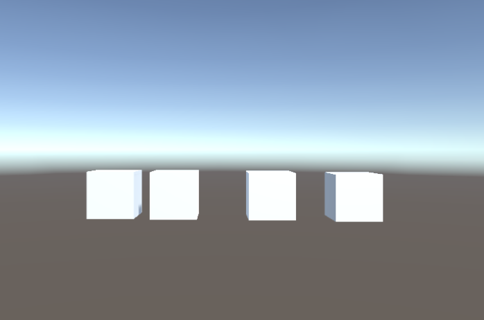
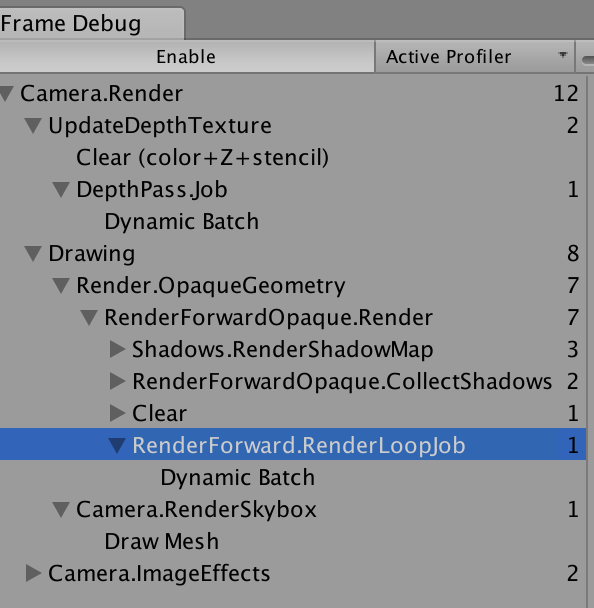
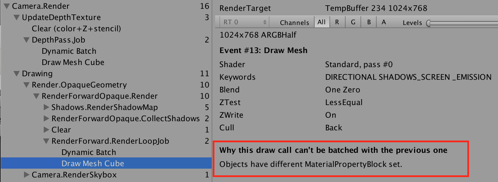
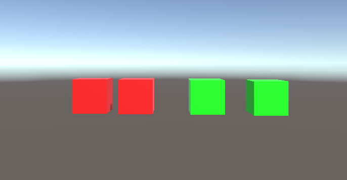
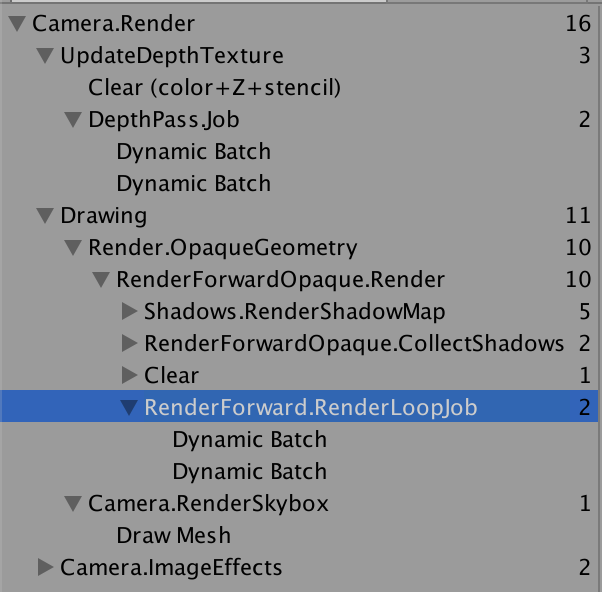
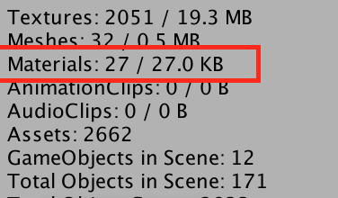

对使用相同材质的物体设置不同的材质属性是一个常见的需求，可以使用`Render.material`生成一个新的材质并设置属性，这需要更多内存，并且会破坏可能的batching，所以要尽量避免使用。另一种方法是用`Render.SetPropertyBlock(MaterialPropertyBlock properties)`设置属性，接下来就分析这种做法对batching的影响。

首先建立一个测试工程，新建一个场景，场景中添加4个默认cube，为每个cube挂载下面的脚本

```CSharp
using System.Collections;
using System.Collections.Generic;
using UnityEngine;
using UnityEngine.EventSystems;

public class SetMaterialProperty : MonoBehaviour, IPointerDownHandler {
    int index;
    Renderer renderer;
    MaterialPropertyBlock propertyBlock;

    void Awake()
    {
        renderer = GetComponent<Renderer> ();
        propertyBlock = new MaterialPropertyBlock ();
        renderer.GetPropertyBlock (propertyBlock);
    }

    public void NextColorProperty()
    {
        switch (index) {
        case 0:
            propertyBlock.SetColor ("_Color", Color.red);
            break;
        case 1:
            propertyBlock.SetColor ("_Color", Color.green);
            break;
        case 2:
            propertyBlock.SetColor ("_Color", Color.yellow);
        break;
        }

        renderer.SetPropertyBlock (propertyBlock);

       index = ++index%3;
    }

    #region IPointerDownHandler implementation

    public void OnPointerDown (PointerEventData eventData)
    {
        NextColorProperty ();
    }

    #endregion
}
```

运行测试场景，并打开Frame Debugger，结果如下:



Frame Debugger中选中的部分就是渲染4个cube所需的draw call，可以看出unity一次渲染这四个cube。然后通过MaterialPropertyBlock设置其中一个cube的_Color属性，再次观察Frame Debugger，结果如下：


可以看出Unity需要两次draw call来渲染这四个cube，一次动态批处理，一次是设置了_Color属性的cube。红框部分说明了设置不同的MaterialPropertyBlock会破坏batching，这句话隐含的意思是使用相同的属性cube会合并一起渲染，接下来测试一下这种情况：



可以看出使用了相同属性的cube被动态批处理了，也就说通过`MaterialPropertyBlock`设置的属性相同时不会破坏批处理，对于不同属性相同mesh的物体可以使用[GPU Instancing](https://docs.unity3d.com/Manual/GPUInstancing.html)减少draw call。

[这篇博客](https://thomasmountainborn.com/2016/05/25/materialpropertyblocks/) 说用`MaterialPropertyBlock`设置的材质属性需要在shader中添加[PerRendererData]，否则Unity内部会创建新的材质。根据我的测试，不管有没有[PerRenderData]都不会创建新的材质


根据[论坛](https://forum.unity.com/threads/learn-how-to-use-materialpropertyblocks-and-perrendererdata-for-great-performance-gains.406638/)里官方人员的说法[PerRenderData]并没有实际的作用，只为了说明这个属性是通过MaterialPropertyBlock设置的。

